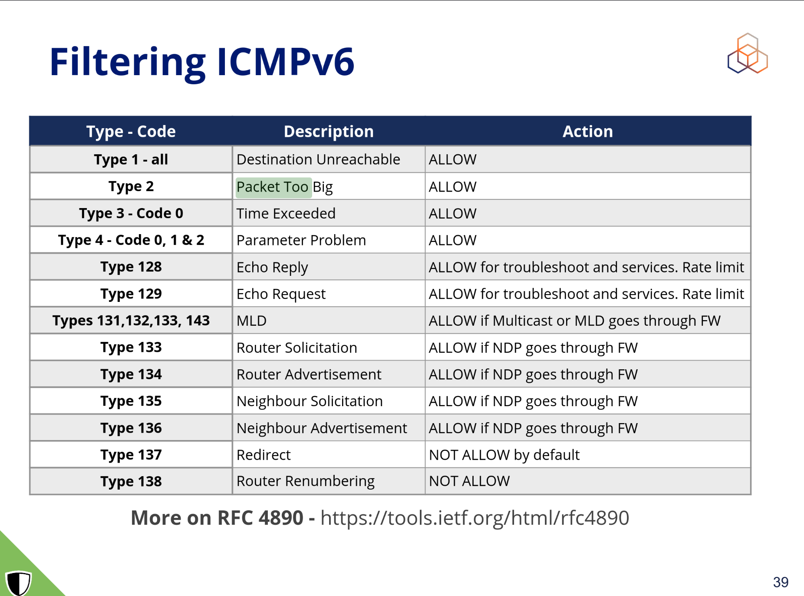
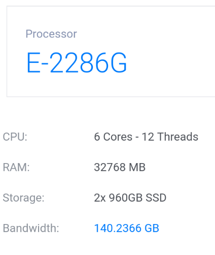
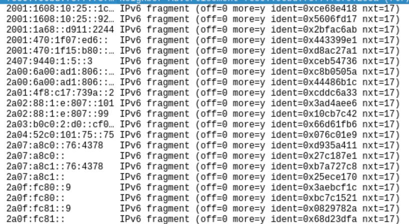
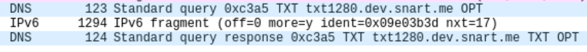
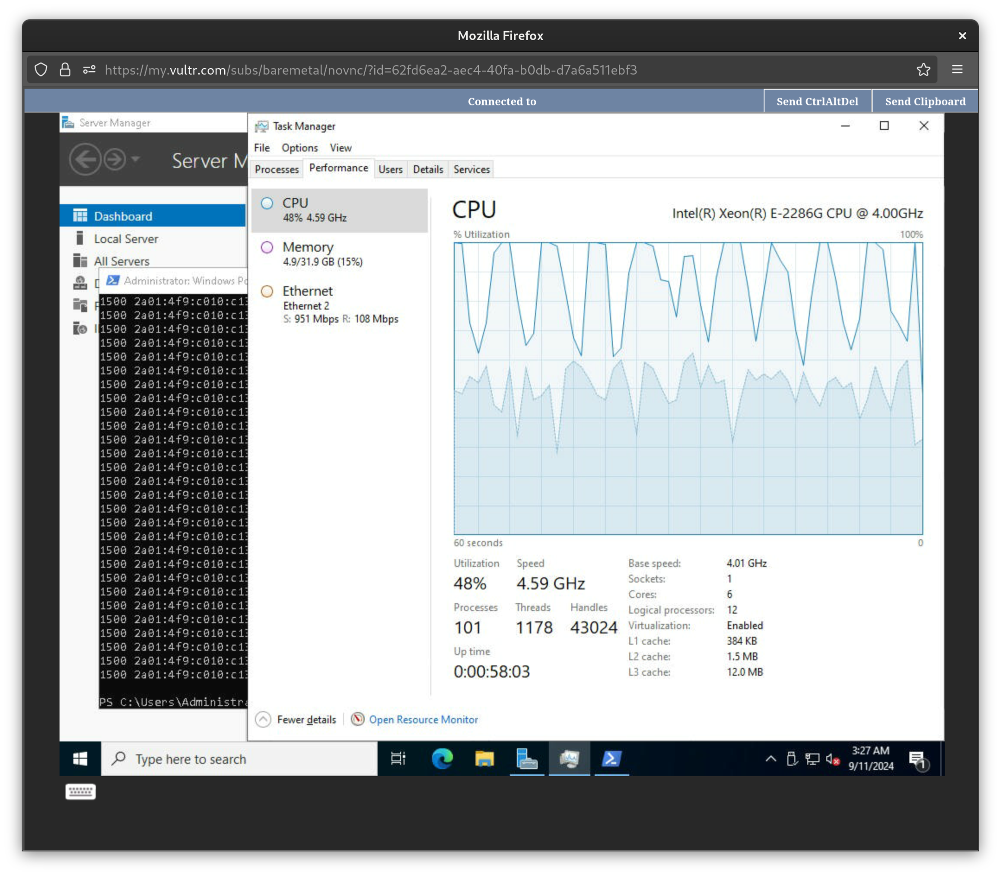

# Random Source Attack("rsrca") Project
This is a work in progress.

The way various OSes implement PMTUD is fundamentally flawed. They might as well
have deprecated PMTUD in IPv6 as min MTU ramped up to 1280 and all the hardware
manufactured today support MTU way larger than 1500. PMTUD shouldn't really have
made it to IPv6, but here we are.

The major issue is that the internet standard(RFC) mandates caching of /128
addresses. A v6 LAN prefix is /64. The `2^64` address space is too large for
modern computers. This can easily be abused for DoS attacks.

Caching /128 addresses doesn't make any sense as a /64 prefix is almost always a
stub network(ie. terminating L2 segment). There could be some extreme edge
cases, but that's on the netadmin that let such cases happen. Concealed
bottleneck MTU paths should always be avoided, at all costs.

So, a compromise: if we want to keep PMTUD in IPv6, maybe we should cache /64
prefix instead of the whole /128?

## MSCVD
Some of the issues have been reported to Microsoft Coordinated Vulnerability
Disclosure(MSCVD).

These issues have been deemed "not vulnerabilities" by Microsoft researchers.
I'm planning to set up a "patch honeypot", a set of CD/CI automation to detect
updates that fix the issues I disclosed with Microsoft. In the meantime, you
know what to do with them. The random source amplification attack is quite
effective, even to the most robust bare metal server out there.

The competency of the researchers have been [in
question](https://www.theregister.com/2025/03/17/microsoft_bug_report_troll/)
over the years. Should you find a vulnerability in Microsoft's products, I
suggest going to 3rd party bounty programs like
https://www.zerodayinitiative.com/.

### IPv6 Random Source Attack
[doc/mscvd-ipv6-random-source-attack.md](doc/mscvd-ipv6-random-source-attack.md)

The Windows kernel has more serious problems that needed to be addressed. As
with other Unices, The Windows kernel also suffer from PMTUD cache flooding
attack. However, unrelated to the PMTUD issue, I found that the way that Windows
kernel handles UDP/IPv6 from multiple source addresses has some other
implications.

### MS DNS has no cache memory limit
[doc/mscvd-msdns-no-cachemem-limit.md.md](doc/mscvd-msdns-no-cachemem-limit.md.md)

Also found that MS DNS has no sane default value for memory limit. The limit can
be set, but the point is that the default is unlimited and the way it can be set
is rather cryptic.

A Windows server running MS DNS with default settings will crash when it's
filled with garbage DNS query results by a malicious actor.

## Notes
CVEs:

- https://iepg.org/2019-07-21-ietf105/fujiwara.pdf
- https://nvd.nist.gov/vuln/detail/CVE-2023-52340
- https://bugzilla.redhat.com/show_bug.cgi?id=CVE-2023-52340
- https://ubuntu.com/security/CVE-2023-52340
- https://security-tracker.debian.org/tracker/CVE-2023-52340

It's quite a recent patch as of writing. This means that it was easy to crash
unpatched machines before the discovery of the CVE.

Prelude:

- https://www.ripe.net/media/documents/IPv6Security-2hrs-PART_3.pdf



If anything, PTB and Fragmentation Needed should be rate limited by /64 and /24
prefix, too. The firewall products can rate limit on /64 for all the other types
of packets such as TCP SYN not /128 addresses. Any implementation that caches
/128 is basically asking for troubles.

## Observation on Public DNS Servers
To see if pmtu cache flooding attack is possible on public DNS servers, I set up
a long TXT record in my domain zone file and queried it. Cloudflare and Cloud9
public RDNSS appear to have the upper UDP trunc length of 1232 octets.

```
(minimum IPv6 mtu) - (IPv6 header length) - (UDP header length) =
1280 - 40 - 8 = 1232
```

Because they use ISC's BIND9? `isc__nm_socket_min_mtu()` in
`lib/isc/netmgr/socket.c`:

```c
isc_result_t
isc__nm_socket_min_mtu(uv_os_sock_t fd, sa_family_t sa_family) {
	if (sa_family != AF_INET6) {
		return (ISC_R_SUCCESS);
	}
#ifdef IPV6_USE_MIN_MTU
	if (setsockopt_on(fd, IPPROTO_IPV6, IPV6_USE_MIN_MTU) == -1) {
		return (ISC_R_FAILURE);
	}
#elif defined(IPV6_MTU)
	if (setsockopt(fd, IPPROTO_IPV6, IPV6_MTU, &(int){ 1280 },
		       sizeof(int)) == -1)
	{
		return (ISC_R_FAILURE);
	}
#else
	UNUSED(fd);
#endif

	return (ISC_R_SUCCESS);
```


The Google Public DNS Servers, on the other hand do not seem to have this
restriction.

```
$ dig @2001:4860:4860::8888 +notcp +bufsize=1472 TXT txt1280.dev.snart.me

; <<>> DiG 9.18.28 <<>> @2001:4860:4860::8888 +notcp +bufsize TXT txt1280.dev.snart.me
; (1 server found)
;; global options: +cmd
;; Got answer:
;; ->>HEADER<<- opcode: QUERY, status: NOERROR, id: 24672
;; flags: qr rd ra; QUERY: 1, ANSWER: 1, AUTHORITY: 0, ADDITIONAL: 1

;; OPT PSEUDOSECTION:
; EDNS: version: 0, flags:; udp: 512
;; QUESTION SECTION:
;txt1280.dev.snart.me.		IN	TXT

;; ANSWER SECTION:
txt1280.dev.snart.me.	3600	IN	TXT	"012345678901234567890123456789012345678901234567890123456789012345678901234567890123456789012345678901234567890123456789012345678901234567890123456789012345678901234567890123456789012345678901234567890123456789012345678901234567890123456789012345678901234" "012345678901234567890123456789012345678901234567890123456789012345678901234567890123456789012345678901234567890123456789012345678901234567890123456789012345678901234567890123456789012345678901234567890123456789012345678901234567890123456789012345678901234" "012345678901234567890123456789012345678901234567890123456789012345678901234567890123456789012345678901234567890123456789012345678901234567890123456789012345678901234567890123456789012345678901234567890123456789012345678901234567890123456789012345678901234" "012345678901234567890123456789012345678901234567890123456789012345678901234567890123456789012345678901234567890123456789012345678901234567890123456789012345678901234567890123456789012345678901234567890123456789012345678901234567890123456789012345678901234" "01234567890123456789012345678901234567890123456789012345678901234567890123456789012345678901234567890123456789012345678901234567890123456789012345678901234567890123456789012345678901234567890123456789"

;; Query time: 131 msec
;; SERVER: 2001:4860:4860::8888#53(2001:4860:4860::8888) (UDP)
;; WHEN: Mon Sep 09 17:24:56 CEST 2024
;; MSG SIZE  rcvd: 1286

```

We see that the query may potentially result in PMTUD. Whether the RDNSS would
accept and process the PTB is unknown. PTB packets probably wouldn't make it
through the middleboxes, but one possible attack vector is that the pmtu cache
flooding could occur on the load balancers. There's simply no way of knowing
from outside world.

// **UPDATE**: some telcos actually run multiple DNS servers behind LB without
firewall. I found that Windows servers run by a particular ISP evidently accept
PTB(the UDP DNS message was returned fragmented)

So I went on to see if the Google public dns servers are susceptible to PTMU
deflection attack. I had to build my own `dig` to disabled the MIN_MTU settings
in BIND9([patch](doc/bind9_no-mtu-opt.patch)).

```
IP6 (flowlabel 0xc94b7, hlim 62, next-header TCP (6) payload length: 40) 2a01:4f8:1c1b:a391:ffff:0:3:1.43265 > 2001:4860:4860::8844.domain: Flags [S], cksum 0x27de (incorrect -> 0x84dc), seq 3192143250, win 64800, options [mss 1440,sackOK,TS val 610653428 ecr 0,nop,wscale 7], length 0
IP6 (flowlabel 0x1df7a, hlim 56, next-header TCP (6) payload length: 40) 2001:4860:4860::8844.domain > 2a01:4f8:1c1b:a391:ffff:0:3:1.43265: Flags [S.], cksum 0x6b29 (correct), seq 3346264814, ack 3192143251, win 65535, options [mss 1440,sackOK,TS val 66082927 ecr 610653428,nop,wscale 8], length 0
IP6 (flowlabel 0xc94b7, hlim 62, next-header TCP (6) payload length: 32) 2a01:4f8:1c1b:a391:ffff:0:3:1.43265 > 2001:4860:4860::8844.domain: Flags [.], cksum 0x27d6 (incorrect -> 0x97e3), ack 1, win 507, options [nop,nop,TS val 610653432 ecr 66082927], length 0
IP6 (flowlabel 0xc94b7, hlim 62, next-header TCP (6) payload length: 95) 2a01:4f8:1c1b:a391:ffff:0:3:1.43265 > 2001:4860:4860::8844.domain: Flags [P.], cksum 0x2815 (incorrect -> 0x580c), seq 1:64, ack 1, win 507, options [nop,nop,TS val 610653432 ecr 66082927], length 63 14983+ [1au] TXT? txt1280.dev.snart.me. (61)
IP6 (flowlabel 0x1df7a, hlim 56, next-header TCP (6) payload length: 32) 2001:4860:4860::8844.domain > 2a01:4f8:1c1b:a391:ffff:0:3:1.43265: Flags [.], cksum 0x989b (correct), ack 64, win 256, options [nop,nop,TS val 66082931 ecr 610653432], length 0
IP6 (flowlabel 0x1df7a, hlim 56, next-header TCP (6) payload length: 1240) 2001:4860:4860::8844.domain > 2a01:4f8:1c1b:a391:ffff:0:3:1.43265: Flags [.], cksum 0x2c8e (incorrect -> 0x9e8e), seq 1:1209, ack 64, win 256, options [nop,nop,TS val 66082932 ecr 610653432], length 1208 [prefix length(1286) != length(1206)] (invalid)
IP6 (flowlabel 0x1df7a, hlim 56, next-header TCP (6) payload length: 112) 2001:4860:4860::8844.domain > 2a01:4f8:1c1b:a391:ffff:0:3:1.43265: Flags [P.], cksum 0x2826 (incorrect -> 0x4b6e), seq 1209:1289, ack 64, win 256, options [nop,nop,TS val 66082932 ecr 610653432], length 80 [prefix length(12594) != length(78)] (invalid)
```

Although Google's own implementation does not advertise 1220 MSS, it does seem
to have the socket's internal MSS so their public DNS servers are not vulnerable
to the attack. The only thing that needs to be fixed is the UDP MSS so that
truncated messages are delivered to the clients behind 1280 mtu paths.

## PTB (Replay) Attack
// **UPDATE**: tl;dr: set up a TXT record longer than 1280 bytes, run `rsrca` in
[mtu1280-c netns](https://github.com/si-magic/mtu1280d/tree/master/netns) to
make the server return it in UDP response.

1. Send a UDP packet(DNS for example) or TCP data behind the "one-way" mtu 1280
   path
1. The victim server responds to it
1. The router sends it back with PTB
1. The PTB is validated and accepted by the server
1. The new PMTU is cached
  - ICMP aware applications will attempt to redo the request? (DNS trunc) //
  **UPDATE**: turns out, getting the info in ICMP error to the userspace very
    Linux specific(`IP_RECVERR`)

(Continued for replay attack for TCP connections)

1. the server does retransmission
1. The malicious router sends the mtu adjusted traffic back to the server
1. The server caches PMTU again, does retransmission
1. Repeat until the server gives up on (RST)

## Scanning for Vulnerable DNS Servers
// **UPDATE**: this is all wrong. There are still Linux/BSD implementations that
advertises UDP msgsize=4096 and don't care about PMTU_DISC sockopt. The only
thing that fragmented UDP packets tell us is whether the server is BIND9 or the
like or not. `version.bind CHAOS TXT` and `hostname.bind CHAOS TXT` queries
should also be used.




The actual iface was 5Gbps x 2 with only one of the ports connected, so 5Gbps
was available.

Wrote the shell scripts to find the vulnerable servers.

```sh
./spew-dns-servers.sh |
	sudo ip netns exec mtu1280-c ./scan-dns-servers.sh |
		sort | tee 1280.out
```

If you run the script in the default netns(ie. without `sudo ip netns exec
mtu1280-c`), you just get the list of all active IPv6 DNS servers on the
internet.

Of all the servers tested, select the servers that were active and the ones that
did pmtud for UDP traffic.

```sh
grep -E 'UDP|TCP' 1280.out
grep UDP 1280.out
```

The list:

```
2001:148f:fffe::1                            : PING     TCP
2001:148f:ffff::1                            : PING     TCP
2001:1608:10:25::1c04:b12f                   : PING UDP TCP 
2001:1608:10:25::9249:d69b                   : PING UDP TCP
2001:1a68::d911:2244                         : PING UDP TCP
2001:1bc0::ffff:aaaa:2                       : PING     TCP
2001:1bc0::ffff:bbbb:2                       : PING     TCP
2001:418:3ff::1:53                           : PING     TCP
2001:418:3ff::53                             : PING     TCP
2001:41d0:700:13cb:141:95:6:51               : PING     TCP
2001:428:101:100:205:171:3:65                : PING     TCP
2001:468:c80:2101:0:100:0:22                 : PING     TCP
2001:468:c80:4101:0:100:0:42                 : PING     TCP
2001:470:0:45::2                             : PING     TCP
2001:470:1f07:ed6::                          : PING UDP TCP
2001:470:1f15:b80::53                        : PING UDP TCP
2001:470:20::2                               : PING     TCP
2001:4860:4860::6464                         : PING     TCP
2001:4860:4860::64                           : PING     TCP
2001:4860:4860::8844                         : PING     TCP
2001:4860:4860::8888                         : PING     TCP
2001:4b8:2:101::602                          : PING     TCP
2001:4b8:3:201::902                          : PING     TCP
2001:4ba0:ffa4:3f7::                         : PING     TCP 
2001:550:1:1::d                              : PING     TCP 
2001:550:1:2::d                              : PING     TCP
2001:678:e68:f000::                          : PING     TCP
2001:67c:2b0::1                              : PING     TCP
2001:67c:2b0::2                              : PING     TCP
2001:738:6001:b0b0::1000                     :          TCP
2001:8d8:820:3a00::b:c47                     : PING     TCP
2001:910:800::12                             : PING     TCP
2001:910:800::40                             : PING     TCP
2001:978:1:2::d                              : PING     TCP
2001:b000:168::1                             : PING     TCP
2001:dc8:1:2::106                            :          TCP
2001:de2::1                                  : PING     TCP
2001:de4::101                                : PING     TCP
2001:df0:27b::226                            : PING     TCP
2400:6180:0:d0::5f6e:4001                    :          TCP
2400:8902::f03c:91ff:feda:c514               :          TCP
2407:9440:1:5::3                             : PING UDP TCP
2409::1                                      : PING     TCP
2604:a880:0:1010::b:4001                     :          TCP
2604:ffc0::                                  : PING     TCP
2606:4700:4700::1111                         : PING     TCP
2606:4700:4700::1113                         : PING     TCP
2606:4700:4700::6400                         : PING     TCP
2606:4700:4700::64                           : PING     TCP
2610:a1:1018::5                              : PING     TCP
2620:0:ccd::2                                : PING UDP
2620:10a:80bb::20                            : PING     TCP
2620:fe::11                                  : PING     TCP
2620:fe::9                                   : PING     TCP
2620:fe::fe:10                               : PING     TCP
2620:fe::fe:11                               : PING     TCP
2620:fe::fe:9                                : PING     TCP
2620:fe::fe                                  : PING     TCP
2a00:6800:3:4bd::1                           : PING     TCP
2a00:6a00:ad1:806::83                        : PING UDP TCP
2a00:6a00:ad1:806::86                        : PING UDP TCP
2a00:f826:8:1::254                           : PING     TCP
2a00:f826:8:2::195                           : PING     TCP
2a01:238:4231:5200::1                        : PING     TCP
2a01:4f8:141:316d::117                       : PING     TCP
2a01:4f8:151:34aa::198                       : PING     TCP
2a01:4f8:172:1d2a::2                         : PING     TCP
2a01:4f8:c17:739a::2                         : PING UDP TCP
2a02:2970:1002::18                           : PING     TCP
2a02:6b8:0:1::feed:a11                       : PING     TCP
2a02:6b8:0:1::feed:bad                       : PING     TCP
2a02:6b8:0:1::feed:ff                        : PING     TCP
2a02:6b8::feed:bad                           : PING     TCP
2a02:6b8::feed:ff                            : PING     TCP
2a02:88:1:e:807::101                         : PING UDP TCP
2a02:88:1:e:807::99                          : PING UDP TCP
2a02:bf8:aaaa::10                            : PING     TCP
2a02:bf8:aaaa::11                            : PING     TCP 
2a03:4000:4d:c92:88c0:96ff:fec6:b9d          : PING     TCP
2a03:90c0:9992::1                            : PING     TCP
2a03:90c0:999d::1                            : PING     TCP
2a03:94e0:1804::1                            : PING     TCP
2a03:b0c0:2:d0::cf0:c001                     : PING UDP TCP
2a04:52c0:101:75::75                         : PING UDP
2a06:1c40:3::13                              : PING     TCP
2a07:a8c0::76:4378                           : PING UDP TCP
2a07:a8c0::                                  : PING UDP TCP
2a07:a8c1::76:4378                           : PING UDP TCP
2a07:a8c1::                                  : PING     TCP
2a09:5302:ffff::ac9                          : PING     TCP
2a09::                                       : PING     TCP
2a0a:51c0::7fe                               : PING     TCP
2a0d:2a00:1::2                               : PING     TCP
2a0d:2a00:2::2                               : PING     TCP
2a0f:fc80::9                                 : PING UDP TCP
2a0f:fc80::                                  : PING UDP TCP
2a0f:fc81::9                                 : PING UDP TCP
2a0f:fc81::                                  : PING UDP TCP
2a10:50c0::1:ff                              : PING     TCP
2a10:50c0::2:ff                              : PING     TCP
2a10:50c0::ad1:ff                            : PING     TCP
2a10:50c0::ad2:ff                            : PING     TCP
2a11::                                       : PING     TCP
```

- Out of 134 active servers, 21 servers honor pmtu for UDP traffic, possibly
  vulnerable to the attack

Fire up Wireshark or tcpdump, observe the behaviour of the servers. The use of
IPv6 fragment indicates possible Microsoft DNS.




```sh
QUERY_STR="TXT txt1280.dev.snart.me"
BUFSIZE=1452
# The servers vulnerable to the UDP attack
grep 'UDP' 1280.out | cut -d ' ' -f1 | while read ip
do
	sudo ip netns exec mtu1280-c dig "@$ip" +notcp +ignore +timeout=5 +retries=2 +bufsize=$BUFSIZE $QUERY_STR
done
```

TODO: must be tried multiple times(at least 256 times) as service
providers(especially legacy telcos) usually run multiple resolvers behind LB

The list:

```
2a0f:fc81::9
2a0f:fc81::
2a0f:fc80::9
2a0f:fc80::
2a07:a8c1::76:4378
2a07:a8c1::
2a07:a8c0::76:4378
2a07:a8c0::
2a04:52c0:101:75::75
2a03:b0c0:2:d0::cf0:c001
2a02:88:1:e:807::99
2a02:88:1:e:807::101
2a01:4f8:c17:739a::2
2a00:6a00:ad1:806::86
2a00:6a00:ad1:806::83
2407:9440:1:5::3
2001:470:1f15:b80::53
2001:470:1f07:ed6::
2001:1a68::d911:2244
2001:1608:10:25::9249:d69b
2001:1608:10:25::1c04:b12f
```

- All of the servers used IPv6 fragments, indicative of ICMP PTB reaching to the
  server and Microsoft DNS honoring PMTU by fragmenting UDP packets
- `UDP size: 4096` also a give way. BIND9 and proprietary DNS implementations
  use a value way less than that of MS DNS(usually 1232 or 512)

## Attack on a real Windows Machine
The general set up

4 processes were able to pull ~400Mbps of traffic. 10% cpu usage was observed
when the DNS service was off. It appears that MS DNS server implementation has
some optimisation issues so it's not really a fair trial. But when a single
source address was used, the system was stable even though the CPU usage was at
100%. Tried turning off the firewall - no difference. Tried both PTB query and
simple query answer < 512 bytes. No difference. **I think it's just the
performance issue in the kernel**. Random source address attack had no effect when
the DNS server was off.

// **UPDATE**: it was. The issue wasn't the PMTU cache(`netsh int ipv6 show
dest`) being filled with garbage. I suspect it has something to do with the
kernel keeping track of all UDP traffic flows, **regardless of whether the
datagrams are ack'd or not**.

Saw a ratio of 1:10 in traffic amplification(Rx: ~150Mbpx, Tx: 1.2Gbps). Note
that it's only about 20% of the bandwidth available. Took 3 processes of `rsrca`
across 2 Hetzner instances to hog all the processors on the victim Windows
machine, 4 to make it unstable and unresponsive. The RDP connection
dropping/stuttering, the IIS missing some HTTP requests, GUI becoming
sluggish/unresponsive/frozen.

// **UPDATE**: turns out to be due to kernel bottleneck



// **UPDATE**: I suspect that the sawtooth pattern is from the processes not
getting CPU time when the kernel is bottlenecking

The CPU usage in the image shows an ~~oscillating~~ sawtooth pattern. My guess
is: when the context locks up in the cache update, the amount of traffic getting
processed drops and shoots back up again when cache gc takes less time to
finish.

I'm sure `rsrca` can be implemented in the kernel space for efficiency to reduce
the resource ratio, but I think the POC is feasible enough.

// **UPDATE**: one core modern CPU can pull a few tens of thousands pps. Good
enough to take down robust servers. ISP fabric routers can't handle that amount
of pps, anyways

## TODO
- Be sure to block incoming DNS so that the attacker host won't send back ICMP
- Don't just measure the system load of the victim. Also measure the legitimate
  response rate to see the real-life impact: w/ and w/o attack taking place,
  random source and single source. Windows will struggle under attack from
  random sources
- Measure impact on Nginx/Apache(ALBs and cache servers) and classical LB
- **print ISO time in the logs to plot charts in the paper**

### TODO The Double Whammy Lock up
Ignore TCP RST and ICMP to victim's dst port or mark the packets so that the
kernel wouldn't care about the offense traffic. I think the latter would be
optimal.

```sh
ip6tables -I OUTPUT -p tcp --tcp-flags RST -m multiport --dport 53,80,443 --dst 2001:db1::1280/128  -j DROP
ip6tables -I OUTPUT -p ipv6-icmp --icmpv6-type 1/4 -m multiport --dport 53,80,443 --dst 2001:db1::1280/128  -j DROP

ip6tables -t mangle -A PREROUTING -p tcp -m multiport --sport 53,80,443 --src 2001:db1::1280/128 -j NFQUEUE --queue-num 9999
ip6tables -t mangle -A PREROUTING -p udp -m multiport --sport 53,80,443 --src 2001:db1::1280/128 -j NFQUEUE --queue-num 9999
```

- get rid of mtu1280-netns
- send request to the victim
  - query RR w/ length > 1280 bytes
  - HTTP GET a resource w/ length > 1280
- the victim sends back the response
- the attacker receives it, craft a PTB with it, sends it back to the victim
- the victim accepts the PTB, adjusts the pmtu - performance degradation on the
  net iface doing RCU write lock, doing binary search and sorting
- (in case of HTTP)
  - the victim does TCP retransmission
  - upon receiving PSH w/ length < 1280, the attacker kindly sends FIN, ACK
  - upon receiving FIN, kindly ACK it so that the backlog and the connection
    pool on the victim wouldn't get flooded
- (in case of DNS, optional) the attacker sends the query again so that the
  victim fragments the response - not sure if doing so will result in a
  significant performance degradation, though

As shown, the level of sophistication is higher for TCP attack. The point here
is that most web servers honor PTB. The ones cache the pmtu possibly suffer from
this type of attacks. 1280 is not far from 1500, so it's probably best if all
the servers exposed to the internet use mtu 1280 and ignore PTB.

### TODO PTBs from local prefix and LL should be discarded
TODO

# QUIC
TODO: work in progress

Most IPv6 web servers on the internet do not communicate in mtu 1280 and honors
pmtu from the clients. More sophisticated attacks on non-firewalled HTTP, HTTPS,
QUIC ports could be possible. Establishing and sending legitimate HTTP request
via TCP seems complex on the attacker's end. However, sending one-shot QUIC
initial packet, having the mtu 1280 router to return the response to poison pmtu
cache on the server seems like a feasible attack vector.

## NOTES
- Azure DNS is not vulnerable
  - The nameservers do not appear to be Microsoft DNS (no eat-your-own-dog-food)
  - The private DNS resolvers do not support IPv6 as of yet

- Couldn't get `txt_dns_flood` to work against a VM on Vultr. There's probably a
  firewall involved ...
  1. The firewall parsed the packets and thought they're malformed
  1. The firewall is stateful and it could not associate to any existing
    connection
  1. The firewall drops PTB by default and the users don't have control over it
- The packets did get through when I unlinked the instance from the firewall
  rule

### What You Need to Mount the Attack
- A /64 prefix statically routed to your machine

If the router has to do ND before it routes the traffic to the randomly
generated source address, you'll not only just flood the ND cache of the router
but also be limited to Linux's default 2048 neighbor cache limit on the
router(which is also most likely a linux box), not to mention other side effects
on the network as a whole. Some CSPs do ND in the VPC, making themselves
unfeasible to the attack. The /64 prefixes provided by **Hetzner** are
statically routed to the VMs so that's why I ran the offensive VMs on Hetzner
for testing.

### FreeBSD
Handles pretty well. Hogs only one thread and doesn't even hang when `sysctl
net.inet.tcp.hostcache.list` is called while the attack is in progress. The
system remains responsive.

### Linux
Hogs only one thread. Struggles when `ip -6 route list cache` is run while the
attack is in progress. The NETLINK interface does not provide a way to query
just the number of entries so the list has to be traversed to get the number of
entries. But the sysadmin can tell if they're under attack if they see a massive
amount of pmtu entries, so...

Linux still accepts bogus crafted PTB packets as mentioned in the paper by
Fujiwara et. el. This could still be a serious issue. This behaviour is not
consistent with `ICMP_PARANOIA` introduced in 1997. All of the Linux community
can block PTB and forcefully set the MTUs of all ifaces to 1280 until the issues
with pmtu are solved. If you somehow get the PTB packets through the stateful
firewalls and the Linux machine to accept PTBs, you can easily poison the cache.
I won't see if Google public DNS servers' infrastructure accepts crafted PTBs,
but my money is it must have some impact along the way.

// **UPDATE**: the alternative is having a state table and that's why Windows is
vulnerable to random source attacks in the first place. We can't win this. PMTUD
is from old days and should be deprecated. As for TCP, `ICMP_PARANOIA` check is
still a good idea because TCP is stateful by design

## IPv6 MTUD is not well designed
- Perhaps aggregate to /64 prefix rather than individual /128 addresses? The
  whole protocol is built upon the principle that the /64 prefix length is the
  smallest located at the termini
- /48 is the smallest routable prefix on the internet at the moment. The largest
  block is /16[^1]. `2^16` and `2^48` are in more manageable scale than the
  entire `2^128`

## TODO: mitigation
[`EnablePMTUDiscovery` registry](https://support.microsoft.com/en-us/topic/recommended-tcp-ip-settings-for-wan-links-with-a-mtu-size-of-less-than-576-2312050e-2a1b-1e89-94a1-b2868afa436f)
: only disables MSS option in TCP SYN. do not use

Use `IPV6_PMTUDISC_DONT` socket option when developing UDP server.

[^1]: https://www.reddit.com/r/ipv6/comments/17yuqvp/til_capital_one_is_assigned_the_entire_263016/
[^2]: https://blog.svedr.in/posts/running-path-mtu-discovery-from-windows/
